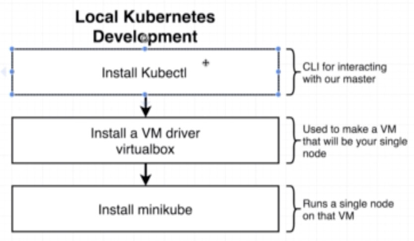

# development env 
* setup

* brew install: 
    go `brew.sh` then install   
* kubectl install
    Run `brew install kubectl`   
* minikube (local only)
    Run `brew install minikube`   
* start minikube `minikube start`
* [if can not start just follow steps](https://stackoverflow.com/questions/52277019/how-to-fix-vm-issue-with-minikube-start)

# production env
* do it yourself / gke (google cloud kubernetes engine) / eks (amazon elastic container service for kubernetes)

## issues

* if install virtual box failed: http://osxdaily.com/2018/12/31/install-run-virtualbox-macos-install-kernel-fails/
